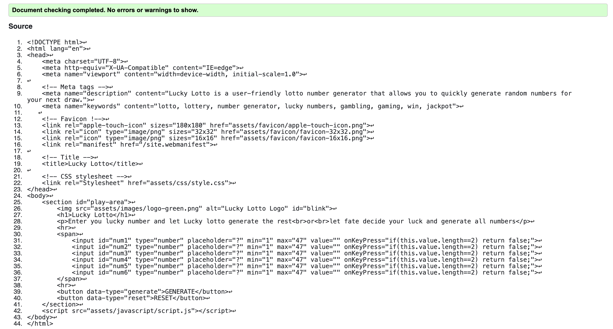
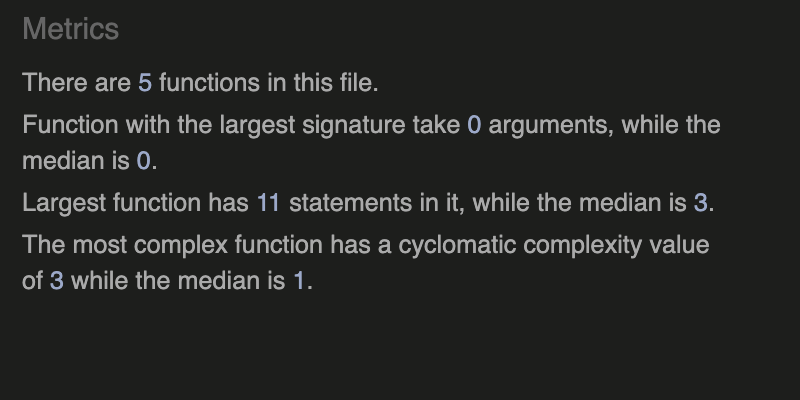
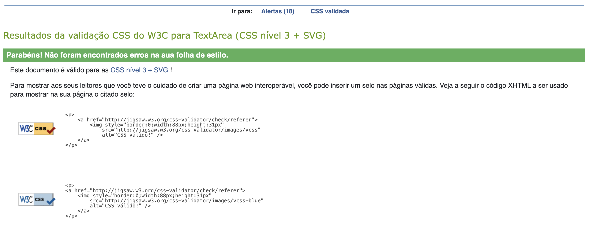
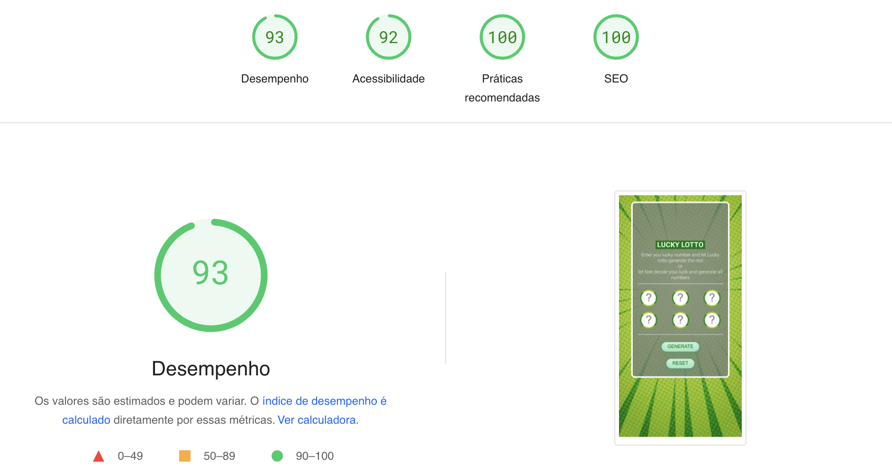
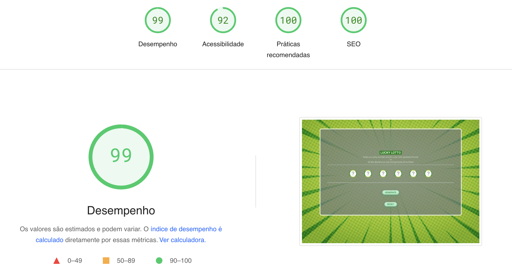
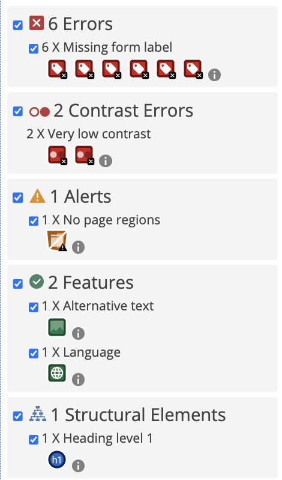

# Lucky-Lotto

Visit [Lucky Lotto's website here](https://vidalwesley92.github.io/Lucky-Lotto/)

## Table of Contents

1. [Introduction](#Introduction)
2. [UX](#UX)
    1. [Target Audience](#Target-Audience)
    2. [User Stories](#User-Stories)
    3. [Site Aims](#Site-Aims)
3. [Design](#Design)
     1. [Wireframes](#Wireframes)
     2. [Site Structure](#Site-Structure)
     3. [Imagery used](Imagery-used)
     4. [Colour Scheme](Colour-Scheme)
     5. [Typography](#Typography)
4. [Features](#Features)
5. [Testing](#Testing)
6. [Bugs](#Bugs)
7. [Technologies Used](#Technologies-Used)
8. [Deployment](#Deployment)
9. [Credits](#Credits)
10. [Acknowledgements](#Acknowledgements)

## Introduction

For this project, I've chosen to develop a lotto number generator called Lucky Lotto. The goal is to generate random numbers from 1 to 47 without repetition, allowing users to input some of the numbers if they wish. Immersing myself in the realm of JavaScript, I've eagerly embarked on this journey, driven by various motivations. As I navigate through the intricacies of coding, I'm filled with anticipation regarding the potential opportunities this venture might bring in the future. Additionally, this endeavor has not only deepened my understanding but also equipped me with new skills in HTML and CSS.

[Go to top ⇧](#Lucky-Lotto)

## UX
### Target Audience

1. Lotto Enthusiasts: This group consists of individuals who regularly participate in lotteries and are interested in tools that can enhance their chances of winning or simply make the process more enjoyable.

2. Casual Gamers: People who enjoy occasional games of chance for entertainment purposes might find Lucky Lotto appealing. It offers a fun and interactive way to generate numbers for personal use or with friends.

3. Programming Beginners: Those who are new to programming, particularly JavaScript, might find Lucky Lotto interesting as it provides a direct and practical project to apply their learning and see tangible results.

## User Stories

* Liam, a lotto player, wants to generate random numbers quickly and easily to use as his lucky numbers for the next draw.

* Lea, a beginner programmer, She want to practice JavaScript skills with a real-world project like a lotto number generator that matches her beginner level. This project should be engaging and encouraging, motivating her to continue coding.

* James, a teacher, he want to provide his students with a fun and practical coding exercise using Lucky Lotto to reinforce their understanding of arrays, random number generation and navegation the DOM.

## Site Aims

- Develop a Practical Application: Create a functional lotto number generator that can be used by individuals to generate random numbers for lotto draws.

- Practice JavaScript Skills: Provide an opportunity for programmers, especially beginners like Lea, to practice and improve their JavaScript skills by working on a real-world project.

- Encourage Learning: Foster a supportive learning environment where users can engage with the code, experiment with modifications, and deepen their understanding of JavaScript concepts.

[Go to top ⇧](#Lucky-Lotto)

# Design

The Lucky Lotto website features a clean and intuitive visual design. Sporting a green background with a pattern, it uses vibrant colors for buttons and headers, resulting in a visually appealing interface. With a well-organized layout and central alignment for essential content like the lotto number generator and instructions, users can navigate effortlessly. Simple and easy-to-read fonts enhance readability, while visual elements such as icons enhance the overall user experience. Furthermore, the website is responsive, ensuring seamless access across various devices.

## Wireframes

Due to the tight deadline, no formal wireframe was developed for Lucky Lotto. Instead, the focus was on crafting a straightforward structure to ensure accessibility for all users. The design aimed for familiarity, making it easy for users to grasp the features intuitively. This simplified approach was chosen to accommodate various user skill levels and ensure a seamless experience. (See picture)

Structure

## Imagery used

The images used on this page were selected from Freepik, a platform for free and premium graphic resources like vector graphics, illustrations, and photos used by designers and businesses for various projects.

Complete list of the images and where it came from:

| PICTURE NAME | SOURCE |
| -------- | ------- |
| Favicon/Logo | https://favicon.io/favicon-converter  |
| Background | https://www.freepik.com/free-vector/comic-style-background_12188985.htm#fromView=search&page=1&position=11&uuid=68369c48-7bf7-48b5-b683-1d7746d7367f |

## Colour Scheme

The color palette for Lucky Lotto was meticulously chosen using [Adobe Color](https://color.adobe.com/), a tool that allows for the extraction of harmonious colors from images. By analyzing the background image employed on the page, the palette was curated to complement its visual elements seamlessly. This approach was chosen to ensures a cohesive and visually appealing design that resonates with the theme and ambiance of the lotto experience. Additionally, the selected colors are optimized for user engagement and readability, enhancing the overall user experience.

Color Scheme

## Typography

In this project, the font choice was deliberate and focused. Roboto was exclusively selected for its exceptional readability and clarity, ensuring an effortless reading experience for users interacting with Lucky Lotto. With its clean and modern appearance, Roboto maintains legibility across various screen sizes and resolutions, making it an ideal choice for web applications. 

| Fonte | Source |
|-------|--------|
| Roboto Flex | https://fonts.google.com/specimen/Roboto+Flex?preview.text=Baiana%20comida%20tipica%20do%20T&preview.size=35&stroke=Sans+Serif |

[Go to top ⇧](#Lucky-Lotto)

# Features

The Lucky Lotto page have the following feature:

* [Page](https://vidalwesley92.github.io/Lucky-Lotto/)
     - A animated logo that matches with the Favicon;
     - A heading with name of the generator;
     - A brief intruction of the generator can do;
     - Input fields, where you can enter numeric values;
     - Two buttons, one that generates the lotto numbers and another that will clear the inputs.

     [Go to top ⇧](#Lucky-Lotto)

# Testing
In this section of the README, various tests that the website underwent are showcased to assess its functionality.
Each test provides valuable insights into the website's performance, functionality, and areas that require attention for future enhancements and optimizations.

## Code Validation

All codes have been validated successfully. The HTML passed through the [W3C HTML Validator](https://validator.w3.org/), the CSS through the [W3C CSS Validator](https://jigsaw.w3.org/css-validator/) and the CSS through the [JS Hint Validator](https://jshint.com/). The following images display their respective validation results.

HTML Validation

Javascript Validation

CSS Validation

## Responsiveness

In order to assess the responsiveness of the website, it was tested across various browsers and screen sizes, ranging from mobile phones screens to desktop screens. Overall, the results were positive, with only one major bug identified.

The bug was discovered while running the page through [Am I Respnsive](https://ui.dev/amiresponsive), where I discovered that the background would not cover the whole screen on Ipads, even though it showed something different in devTools. Thanks to the Stack Overflow community, a solution was found. The solution involved applying a media query that would be specific for the  dimensions of Ipads ([Read Bugs](#Bugs)).

While the website performed well and displayed as expected across different browsers and screen sizes, another bug was identified specifically on phones in landscape mode. Further details about this bug can be found in [ Bugs](#Bugs).

## Lighthouse Testing

The page was subjected to the Lighthouse test to assess its quality and identify areas for improvement. The following images display the results of the test for both the mobile and desktop versions.

Lighthouse Mobile Test

Lighthouse Desktop Test

  
The test results showed that the Lucky Lotto page achieved a high score, indicating excellent performance across various metrics. This outcome signifies that the website excels in areas such as performance, accessibility, best practices, and SEO.

## Accessibility Testing

After running the page through the [Wave Accessibility Evaluation Tool](https://wave.webaim.org/),  the following results were obtained.

Page Test

 
After running the Lucky Lotto page through the accessibility test Wave, a few errors were identified. While some of these errors may be deemed irrelevant to the project's goals and can be ignored, it's crucial to address issues related to contrast errors.

Contrast errors impact the readability and usability of the website, potentially hindering the user experience. Improving contrast ensures that text and elements are easily distinguishable, particularly for users with visual impairments or those viewing the website in suboptimal conditions.

Therefore, while other errors may not be a priority, addressing contrast errors should be considered in future iterations of the project to enhance the overall user experience and accessibility of the Lucky Lotto website.

## Manual Testing

Manual testing was conducted by myself, along with a friend and several coworkers and their devices. This collaborative effort resulted in gathering valuable information, ranging from identifying bugs to outlining future improvements for the website. Below is a table summarizing the testing processes, expectations, and results:

| Feature | Expectation | Action | Result |
|---------|-------------|--------|--------|
| Page Responsiveness | Fill the whole screen when resized | resize | Page fills whole screen when resized|
| Buttons Generate| creation of six random and unique numbers, that range from 1 to 47 is expected  | Click | Six random and unique numbers were created |
| Retain user input | Collect user input and add to the number generator process | click | the iteration of user input with the generation of new number did not occur|
| Button Reset| clear input field| click | Input fields were cleared|

[Go to top ⇧](#Lucky-Lotto)

# Bugs

During testing, several bugs were discovered, leading to malfunctions in certain features of the page. Below are some of the identified bugs along with their respective solutions.

| Bug Description | Browser/ Devices | Severity | Status/ Solution |
|-----------------|------------------|----------|--------|
|Unable to change make background image fit the whole screen for Ipads. | Ipads | Major | Fixed. Used a altered version of a media query found on [Stack Overflow](https://stackoverflow.com/questions/41978487/what-is-correct-media-query-for-ipad-pro).  |
| Unable to not genarate duplicates of the same number. | All | Major | Fixed. Used a altered version of a line of code found on [Stack Overflow](https://stackoverflow.com/questions/62176298/how-to-approach-creating-array-of-random-numbers-with-no-repeats) |
Unable to keep user's input when hitting the generate button | all |  Minor | To be Fixed. The user can write their number, but once they click on the generate button, their input disappears.|
|Landscape mode on mobile creates white bars on the sides. | Mobile | Minor | To be fixed.|

[Go to top ⇧](#Lucky-Lotto)

# Technologies Used

### Laguagues used

* HTML5
* CSS3
* JavaScript

### Frameworks, libraries etc

* [Google Fonts](https://fonts.google.com/);
* [GitPod](https://gitpod.io/);
* [GitHub](https://github.com/);
* [jsfiddle](https://jsfiddle.net/)
* [MDN Web Docs](https://developer.mozilla.org/);
* [W3School Color Converter](https://www.w3schools.com/colors/colors_converter.asp)

[Go to top ⇧](#Lucky-Lotto)

# Deployment

To deploy this project's repository, follow these steps:

1. Go to the Baiana repository on GitHub.
2. Ensure that the HTML, CSS files, and the assets folder are in the repository.
3. Navigate to the repository's navigation bar and open the "Settings" section.
4. In the side menu, locate the "Pages" section and open it.
5. Under the "Source" section, select "Deploy from the main branch".
6. In the Branch section, select "main".
7. Next to the branch options, select the Root folder.
8. After selecting the branch and the folder, click "Save".
9. Once saved, return to the repository and locate the deployments section on the right side of the page, then open it.
10. After opening, the deployed link will be displayed under the title "All deployments" with the following structure: https://vidalwesley92.github.io/Lucky-Lotto/.

[Go to top ⇧](#Lucky-Lotto)

# Credits 

through out this project many resources was utilised in order to complete it. Here are the names of the resource que there due credit.

| resources | Credit|
|-----------|-------|
| ChatGPT | The text, grammar, and spelling were refined, and copyright considerations were addressed with the assistance of ChatGPT. |
| Favicon.io | Fast creation of all favicons necessary for the project. |
| Freepik | Offering a vast collection of free and premium graphic resources |
| Stack overflow | Collection of questions and answers helping with debuging. |
| Love-Math |Reference for coding workflow and good practices. |

[Go to top ⇧](#Lucky-Lotto)

# Acknowledgements

Speacial thank you to:

* Amy, our cohort facilitator, for her availability, assistance, and encouragement throughout all the stages of this project;

* Seun Owonikoko deserves immense appreciation for her invaluable contributions, guidance, and insights that have seamlessly integrated into my workflow.

* Friends and colleagues for all the help provided during testing.

[Go to top ⇧](#Lucky-Lotto)

