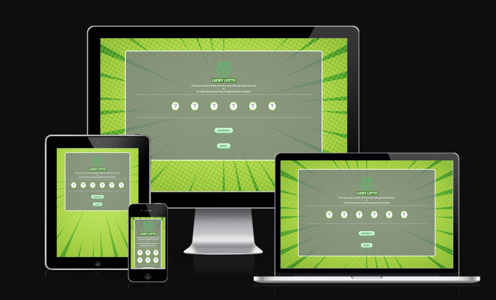
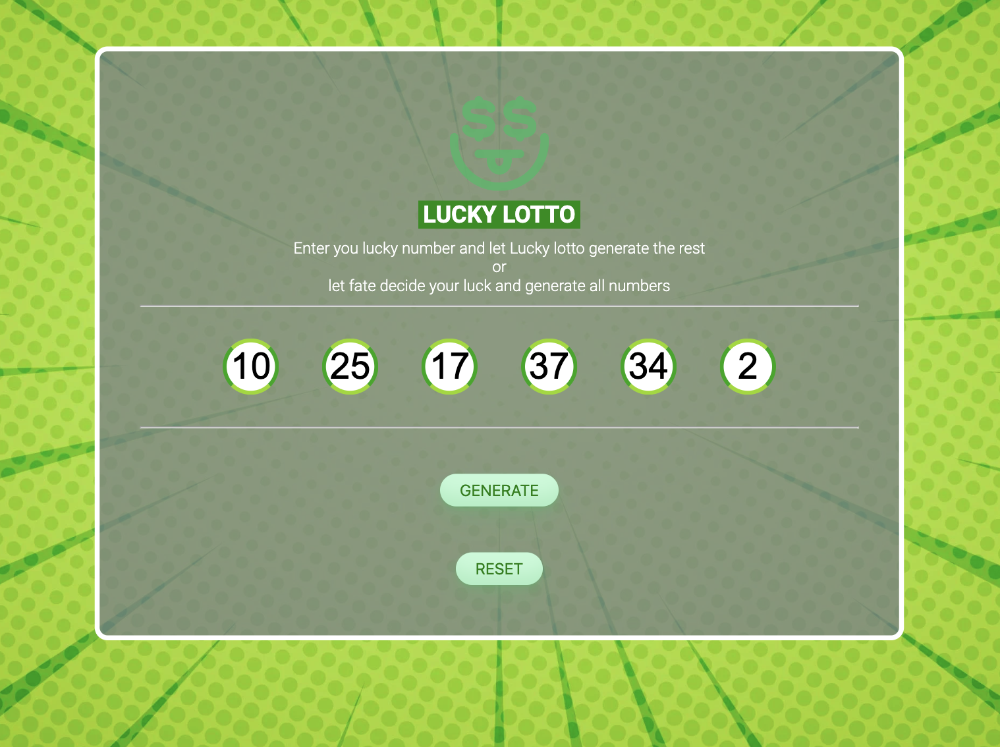
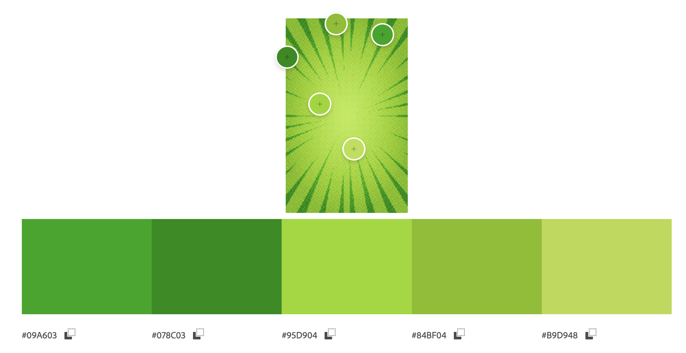

# Lucky-Lotto

Visit [Lucky Lotto's website here](https://vidalwesley92.github.io/Lucky-Lotto/)

## Table of Contents

1. [Introduction](#Introduction)
2. [UX](#UX)
    1. [Target Audience](#Target-Audience)
    2. [User Stories](#User-Stories)
    3. [Site Aims](#Site-Aims)
3. [Design](#Design)
     1. [Wireframes](#Wireframes)
     2. [Site Structure](#Site-Structure)
     3. [Imagery used](Imagery-used)
     4. [Colour Scheme](Colour-Scheme)
     5. [Typography](#Typography)
4. [Features](#Features)
5. [Testing](#Testing)
6. [Bugs](#Bugs)
7. [Technologies Used](#Technologies-Used)
8. [Deployment](#Deployment)
9. [Credits](#Credits)
10. [Acknowledgements](#Acknowledgements)

## Introduction

For this project, I've chosen to develop a lotto number generator called Lucky Lotto. The goal is to generate random numbers from 1 to 47 without repetition, allowing users to input some of the numbers if they wish. Immersing myself in the realm of JavaScript, I've eagerly embarked on this journey, driven by various motivations. As I navigate through the intricacies of coding, I'm filled with anticipation regarding the potential opportunities this venture might bring in the future. Additionally, this endeavor has not only deepened my understanding but also equipped me with new skills in HTML and CSS.

[Go to top ⇧](#Lucky-Lotto)

## UX
### Target Audience

1. Lotto Enthusiasts: This group consists of individuals who regularly participate in lotteries and are interested in tools that can enhance their chances of winning or simply make the process more enjoyable.

2. Casual Gamers: People who enjoy occasional games of chance for entertainment purposes might find Lucky Lotto appealing. It offers a fun and interactive way to generate numbers for personal use or with friends.

3. Programming Beginners: Those who are new to programming, particularly JavaScript, might find Lucky Lotto interesting as it provides a direct and practical project to apply their learning and see tangible results.

## User Stories

* Liam, a lotto player, wants to generate random numbers quickly and easily to use as his lucky numbers for the next draw.

* Lea, a beginner programmer, She want to practice JavaScript skills with a real-world project like a lotto number generator that matches her beginner level. This project should be engaging and encouraging, motivating her to continue coding.

* James, a teacher, he want to provide his students with a fun and practical coding exercise using Lucky Lotto to reinforce their understanding of arrays, random number generation and navegation the DOM.

## Site Aims

- Develop a Practical Application: Create a functional lotto number generator that can be used by individuals to generate random numbers for lotto draws.

- Practice JavaScript Skills: Provide an opportunity for programmers, especially beginners like Lea, to practice and improve their JavaScript skills by working on a real-world project.

- Encourage Learning: Foster a supportive learning environment where users can engage with the code, experiment with modifications, and deepen their understanding of JavaScript concepts.

[Go to top ⇧](#Lucky-Lotto)

# Design

The Lucky Lotto website features a clean and intuitive visual design. Sporting a green background with a pattern, it uses vibrant colors for buttons and headers, resulting in a visually appealing interface. With a well-organized layout and central alignment for essential content like the lotto number generator and instructions, users can navigate effortlessly. Simple and easy-to-read fonts enhance readability, while visual elements such as icons enhance the overall user experience. Furthermore, the website is responsive, ensuring seamless access across various devices.

## Wireframes

Due to the tight deadline, no formal wireframe was developed for Lucky Lotto. Instead, the focus was on crafting a straightforward structure to ensure accessibility for all users. The design aimed for familiarity, making it easy for users to grasp the features intuitively. This simplified approach was chosen to accommodate various user skill levels and ensure a seamless experience. (See picture)

Structure

## Imagery used

The images used on this page were selected from Freepik, a platform for free and premium graphic resources like vector graphics, illustrations, and photos used by designers and businesses for various projects.

Complete list of the images and where it came from:

| PICTURE NAME | SOURCE |
| -------- | ------- |
| Favicon/Logo | https://favicon.io/favicon-converter  |
| Background | https://www.freepik.com/free-vector/comic-style-background_12188985.htm#fromView=search&page=1&position=11&uuid=68369c48-7bf7-48b5-b683-1d7746d7367f |

## Colour Scheme

The color palette for Lucky Lotto was meticulously chosen using [Adobe Color](https://color.adobe.com/), a tool that allows for the extraction of harmonious colors from images. By analyzing the background image employed on the page, the palette was curated to complement its visual elements seamlessly. This approach was chosen to ensures a cohesive and visually appealing design that resonates with the theme and ambiance of the lotto experience. Additionally, the selected colors are optimized for user engagement and readability, enhancing the overall user experience.

Color Scheme

## Typography

In this project, the font choice was deliberate and focused. Roboto was exclusively selected for its exceptional readability and clarity, ensuring an effortless reading experience for users interacting with Lucky Lotto. With its clean and modern appearance, Roboto maintains legibility across various screen sizes and resolutions, making it an ideal choice for web applications. 

| Fonte | Source |
|-------|--------|
| Roboto Flex | https://fonts.google.com/specimen/Roboto+Flex?preview.text=Baiana%20comida%20tipica%20do%20T&preview.size=35&stroke=Sans+Serif |

[Go to top ⇧](#Lucky-Lotto)

# Features

The Lucky Lotto page have the following feature:

* [Page](https://vidalwesley92.github.io/Lucky-Lotto/)
     - A animated logo that matches with the Favicon;
     - A heading with name of the generator;
     - A brief intruction of the generator can do;
     - Input fields, where you can enter numeric values;
     - Two buttons, one that generates the lotto numbers and another that will clear the inputs.

     [Go to top ⇧](#Lucky-Lotto)

# Testing
In this section of the README, various tests that the website underwent are showcased to assess its functionality.
Each test provides valuable insights into the website's performance, functionality, and areas that require attention for future enhancements and optimizations.

